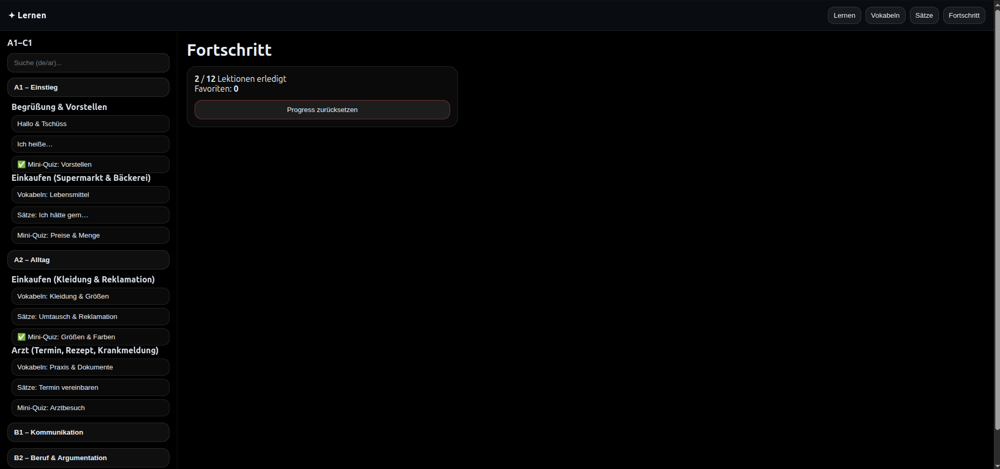

# Lernen (HTML-Version)


Statische, responsive Lern-Webseite für Deutsch (Arabisch → Deutsch).

## Nutzung

Öffne `index.html` direkt im Browser oder starte einen lokalen Server:

```bash
python3 -m http.server 8000
```

Dann im Browser `http://localhost:8000` öffnen.
## Features

- Vokabeltraining Deutsch → Arabisch
- Beispielsätze
- Quiz-System
- Fortschrittsanzeige
- Favoriten speichern
- Suche über Wörter und Sätze


## Projektstruktur

Lernen/
│
├── index.html
├── README.md
│
├── assets/
│   ├── app.js
│   └── styles.css
│
├── data/
│   ├── curriculum.json
│   ├── vocab.json
│   ├── sentences.json
│   └── quizzes.json

## Online Version

Die Seite ist hier verfügbar:

https://abouhema.github.io/Lernen/


## Technologien

Dieses Projekt verwendet:

- HTML
- CSS
- JavaScript
- Git
- GitHub Pages


## Ziel

Diese Web-App soll Menschen helfen, Deutsch zu lernen – besonders arabischen Muttersprachlern.

## Screenshot


